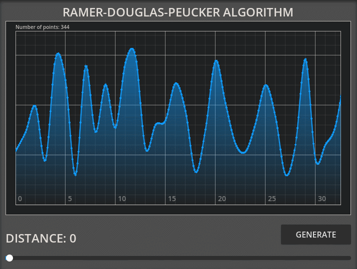

# Ramer-Douglas-Peucker algorithm
Godot (gdscript) implementation of the Ramer-Douglas-Peucker algorithm.

# Example
<p align="center">
  
</p>

# Usage
Call static calculate function from `RamerDouglasPeucker`:

```gdscript
var simplified_points = RamerDouglasPeucker.calculate(points, epsilon) # return reduced points
```

In example:

```gdscript
var points := PackedVector2Array([Vector2(0, 0), Vector2(0, 1), Vector2(0, 2), Vector2(0, 3)])
print(RamerDouglasPeucker.calculate(points, 0.5)) # [(0, 0), (0, 3)]
```
